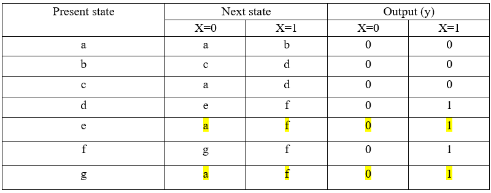

# Minimisation_of_State_Diagram

## 1. Introduction

For the computer architecture part, a problem is given to solve using any programming languages. In the problem, a state diagram has been given. From that, a state table has been derived with having present state, next state and output. The state table shows that some of the present states are having similar next states and outputs. It means a present state is showing the same data again in another present state. It is duplicating. It fills unnecessary space in computer. Therefore, the last duplicating present state will be deleted. If that deleted present state comes in another present state’s next state, the deleted present state will be replaced by the existing present state. This check will happen until it shows the last minimisation of present state. This is process is called state minimisation. To solve this problem in real world, a state table has been given in the requirement documentation. To aid this solution, C++ used in this documentation and process.
 

## 2. Theory

### 2.1 State table & state minimisation table

  

 Figure 1: Initial state machine and table question 
  

  

 Figure 2: State table from state diagram 
  

  

 Figure 3: State minimisation table-1
  

  

 Figure 4: State minimisation table-2
  

This state table, state minimisation table-1 and state minimisation table-2 have shown here to describe the process and to aid to describe the C++ programming language process. The figure 1 is the state table derived from the given state diagram in the task sheet. There present state g and e has same next state and output. Therefore, present state g has removed and replaced by e in other places. That results in figure 2 state minimisation table. Still the present state d and f has same next state and output. Therefore, present state f row has removed and replaced with d in other places. Finally, a minimisation state table got without any duplicate data.   

### 2.2 C++ programming

Likewise, described in state table and state reduction part, this processing has to happen for any element’s user input. Considering the given example table in the requirement sheet. The workflow is happening.

 Figure 5: User inputs and variable declarations
  

<ol>
<li> First, the programme must ask the user “how many states he wants to enter.”</li>
<li> Then, the user must enter the states, such as the next state and output state, when x is 0 and 1 in order.</li>
</ol>

Therefore, as shown in Figure 6, C++ accepts the number of states in integer data type n variable. After, to save the elements, it uses a string array name a[10] variable. The array can use a maximum store of ten states in it.

Now, C++ must start removing duplicating elements and replacing the duplicating elements in the array. It has to happen loop until it gets the minimised state table. Therefore, a loop function will be used here, such as do while loop and for loop. Moreover, a for loop function is used to replace duplicate elements with existing elements. In order, to change state ‘g’ into ‘e’ and state ‘f’ into ‘d’ in the above table.

 Figure 6: Removing duplicate elements
  

As shown in Figure 6, C++ has two nested for loops to compare two following rows. (E.g., in the table comparing ab00, cd00) It happens until the user defined n variable denotes value 7. Then, if the loop finds two similar rows, it takes the row number and saves it in the ‘pos’ variable. According to the requirement sheet table, rows 5 and 7 are similar. In C++, it is 4 and 6 because the ‘i’ variable starts from 0. The 4(i) and 6(j) will add with ASCII char ‘a’ and shows ‘e’ and ‘g.’ They are the present states for the two rows. Then, until the ‘j’ value reaches 7, the duplicate row(g) will take the next row value. Unfortunately, having no values, it becomes empty and the row numbers will reduce by 1.

 Figure 7: Replacing the duplicate element’s present state
  

Figure 7 is the continuation of figure 6 while loop. Next, here according to the state minimisation’s table requirement. The duplicated element’s present state can occur in another present state element’s row. For that reason, must eliminate the duplicate element row’s present state with the existing element’s present state row. Therefore, another for loop must create to check the present state row’s elements. (a: a b 0 0) It checks every present state row element having duplicate row’s present state’ g’ and replaces it with ‘e’ states. It happens the same for the ‘f’ and ‘d’ states in the sheet state table. After finishing these minimised and replaced processes, it comes out from the do-while loop. Here, the do-while loop is used because it is the entry control loop. The Found_pos variable is initially declared as -1 because there is no position such as the -1 position in the array. If the ‘pos’ variable equals -1, it comes out from the while loop. 

 Figure 8: Printing the minimised state table
  

The Figure 8 coding will print the last minimised state table.
